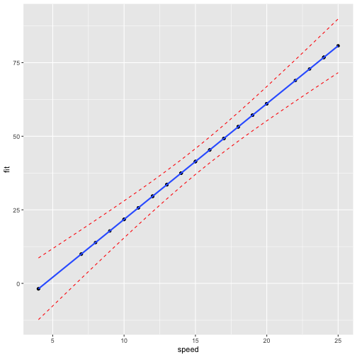

Predicting stopping distance for cars as speed increases
========================================================
author: Mohammed Asif
date: March 18th, 2021
autosize: true

Let's get the data in place
========================================================

We are going to use the cars data like below with linear regression


```r
library("ggplot2")
data("cars", package = "datasets")
model <- lm(dist ~ speed, data = cars)
```


Processing
========================================================

Let's get the confidence intervals for the existing data

```r
mydata <- data.frame(cars, stringsAsFactors = TRUE)
mydata <- mydata[-c(2)]
pred.int <- predict(model, interval = "confidence")
mydata <- cbind(mydata, pred.int)
```

Prediction for the input sent
========================================================

Let's add the new speed with the prediction interval results

```r
new.speed <- data.frame(
              speed = c(input$speed)
            )
newpred.int <- predict(model, newdata = new.speed, interval = "prediction")
mydata <- rbind(mydata, c(input$speed, newpred.int))
```

Plot
========================================================
App Link: https://asif2008.shinyapps.io/test/
Code Link: 


